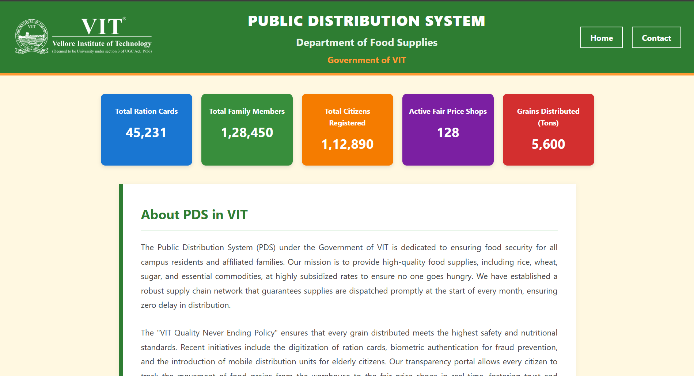
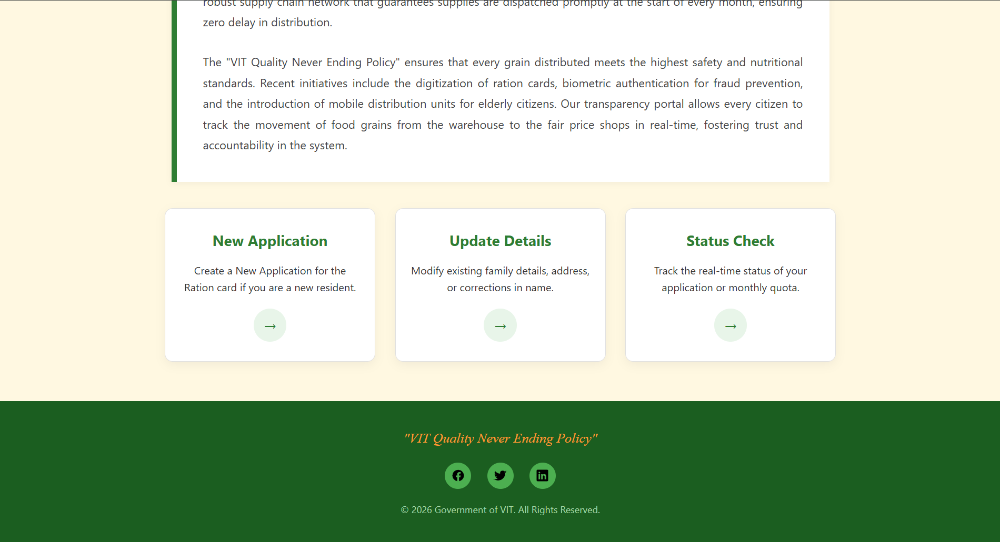

# 🌾 Digital Ration Card Portal

## 📖 Overview
The **Digital Ration Card Portal** is a web-based user interface designed to streamline civil supplies services. It provides a simulation of a government portal where citizens can apply for new ration cards, update their existing details, and check application statuses without visiting a physical office.

## ✨ Key Features
* **New Application Registration:** A comprehensive form interface for capturing applicant details (family members, address, income).
* **Update Details Module:** A dedicated section for users to modify existing information such as address changes or adding family members.
* **Status Tracking:** A user-friendly interface to check the real-time status of submitted applications.
* **Accessible UI:** Designed with clarity and ease of use in mind, simulating real-world government digital services.

## 🛠️ Tech Stack
* **HTML5:** Structured forms and semantic elements.
* **CSS3:** Styling for a clean, professional government-portal aesthetic.

## 🚀 How to Run
1.  Clone this repository:
    ```bash
    git clone https://github.com/sharantejreddy1602-syntropy/ration-card-portal.git
    ```
2.  Navigate to the project folder.
3.  Open `Home_page.html` in your web browser to launch the portal.

## 📸 Screenshots



## 👤 Author
**Madem Sharan Tej Reddy**
* **University:** Vellore Institute of Technology
* **GitHub:** [sharantejreddy1602-syntropy](https://github.com/sharantejreddy1602-syntropy)
